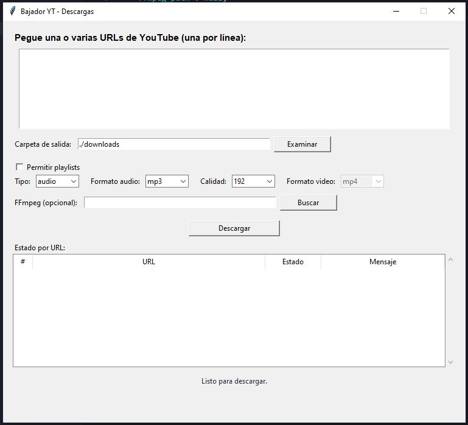

# Bajador de YouTube - Descargador de Audio

Script de Python que automatiza la descarga de audio desde videos de YouTube. Lee una lista de URLs desde un archivo CSV y descarga el audio de cada video en formato MP3.

## 📋 Descripción

Este script permite descargar el audio de múltiples videos de YouTube de forma automatizada. Lee las URLs desde un archivo CSV y descarga cada video como archivo MP3 con calidad de 192 kbps en la carpeta `downloads`.

## 🔧 Requisitos Previos

Antes de usar este script, necesitas tener instalado:

1. **Python 3.6 o superior**
   - Verifica tu versión: `python --version`

2. **FFmpeg**
   - El script detecta FFmpeg automáticamente (PATH o rutas comunes).
   - Opcional: define `FFMPEG_PATH` si tu instalación no está en el PATH.
   - Descarga FFmpeg desde: https://ffmpeg.org/download.html

3. **Librerías de Python**
   - `yt-dlp`: Para descargar videos de YouTube
   - `csv`: Incluida por defecto en Python

## 📦 Instalación

1. **Clona o descarga este repositorio**

2. **Instala las dependencias necesarias:**
   ```bash
   pip install yt-dlp
   ```

3. **Verifica que FFmpeg esté instalado y accesible:**
   - Si no se detecta automáticamente, define la variable:
   ```bash
   set FFMPEG_PATH=C:\ruta\a\ffmpeg\bin\ffmpeg.exe
   ```

## 📁 Estructura del Proyecto

```
bajador-yt/
├── bajador-yt.py      # Script principal
├── url-list.csv       # Archivo CSV con las URLs de YouTube
├── downloads/         # Carpeta donde se guardan los archivos descargados
└── README.md          # Este archivo
```

## 📝 Configuración del Archivo CSV

El archivo `url-list.csv` debe tener el siguiente formato:

```csv
link
https://www.youtube.com/watch?v=VIDEO_ID_1
https://www.youtube.com/watch?v=VIDEO_ID_2
https://www.youtube.com/watch?v=VIDEO_ID_3
```

**Importante:**
- La primera fila debe contener el encabezado `link`
- Cada URL debe estar en una nueva línea
- Las URLs deben ser válidas de YouTube

## 🚀 Uso (CLI con CSV)

1. **Prepara tu archivo CSV:**
   - Edita `url-list.csv` y agrega las URLs de los videos que deseas descargar

2. **Ejecuta el script:**
   ```bash
   python bajador-yt.py
   ```

3. **Espera a que termine:**
   - El script mostrará el progreso de cada descarga
   - Los archivos MP3 se guardarán en la carpeta `downloads/`

## 🖥️ Uso (Interfaz Gráfica)

1. **Ejecuta la interfaz:**
   ```bash
   python app.py
   ```

2. **Pega una o varias URLs:**
   - Una URL por línea

3. **Define la carpeta de salida:**
   - Por defecto: `./downloads`
   - Puedes usar el botón **Examinar** para seleccionar una carpeta

4. **Elige formato y calidad:**
   - Formatos: `mp3`, `m4a`, `opus`, `wav`
   - Calidades: `128`, `192`, `256`, `320`

5. **Haz clic en "Descargar audio":**
   - Verás el estado por URL en la lista
   - El progreso se mostrará en la parte inferior

6. **Opcional: Permitir playlists**
   - Si activas el checkbox, las URLs de playlists descargan todos los videos



## ⚙️ Configuración del Script

Puedes modificar las siguientes opciones en el script:

### Cambiar la carpeta de descarga:
```python
output_folder = './downloads'  # Línea 45
```

### Cambiar la calidad del audio:
```python
'preferredquality': '192',  # Línea 29
# Opciones comunes: '128', '192', '256', '320'
```

### Cambiar el formato de salida:
```python
'preferredcodec': 'mp3',  # Línea 28
# También puedes usar: 'm4a', 'opus', 'wav', etc.
```

### Cambiar la ubicación de FFmpeg:
```bash
set FFMPEG_PATH=C:\ruta\a\ffmpeg\bin\ffmpeg.exe
```

## 📤 Resultado

Después de ejecutar el script, encontrarás los archivos descargados en la carpeta `downloads/` con el siguiente formato:
- Nombre del archivo: `[Título del Video].mp3`
- Formato: MP3
- Calidad: 192 kbps

## ⚠️ Notas Importantes

1. **Respeto a los derechos de autor:**
   - Solo descarga contenido que tengas permiso para descargar
   - Respeta los términos de servicio de YouTube

2. **Límites de YouTube:**
   - YouTube puede limitar las descargas si se realizan muchas en poco tiempo
   - Si encuentras errores, espera unos minutos antes de intentar nuevamente

3. **Espacios en nombres de archivo:**
   - Los nombres se limpian automáticamente para evitar caracteres inválidos

4. **Archivos existentes:**
   - Si el MP3 ya existe, se omite la descarga

5. **FFmpeg requerido:**
   - El script necesita FFmpeg para convertir el audio a MP3
   - Asegúrate de tener FFmpeg instalado y configurado correctamente

## 🐛 Solución de Problemas

### Error: "FFmpeg not found"
- Verifica que FFmpeg esté instalado
- Actualiza la ruta en la línea 25 del script

### Error: "No module named 'yt_dlp'"
- Instala la librería: `pip install yt-dlp`

### Error: "FileNotFoundError: url-list.csv"
- Asegúrate de que el archivo `url-list.csv` exista en la misma carpeta que el script

### Las descargas fallan
- Verifica que las URLs sean válidas
- Comprueba tu conexión a internet
- Algunos videos pueden tener restricciones de descarga

## 📄 Licencia

Este script es de uso personal. Úsalo de manera responsable y respetando los términos de servicio de YouTube.

## 🤝 Contribuciones

Si encuentras algún problema o tienes sugerencias de mejora, siéntete libre de contribuir al proyecto.
